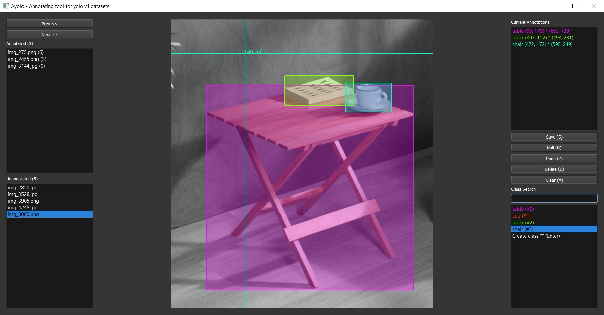

# Ayolo

PyQt5 based annotation tool for yolov4 datasets, providing fast and easy ways of annotating.



Wait what, reinventing the wheel ? Well ... technically yes, but if it has improvements or features that others don't, then why not ?

If you like the tool, a **star** to this repository would be nice.

## Installation

- Requires Python 3.7 (or whatever is supported by PyQt5)
- No executables, build it from source if you need one.
- For global access, install it outside of virtual environments.

```bash
pip install ayolo
```

## Usage

- Call `annotate` with the dataset path, either relative or absolute.

```bash
ayolo annotate <dir_path>
```

## Dataset Structure

```bash
<dir_path>
├── img_1.png
├── img_2.png
├── img_3.png
├── classes.txt
└── annotations.txt
```

- Supported image extensions: `.png`, `.jpg`
- Supported annotations format: `.txt`
- Supported classnames format: `.txt`

## Interfaces

This module provides a PyQt5 window for making annotations on yolov4 datasets. The annotator window consists of 3 interfaces:

### Image Browser (Left)
- Filters for annotated and unannotated images.
- Keyboard and mouse shortcuts for faster navigation.
- Annotations are saved every time an image it's navigated away from.

### Annotator (Center)
- Twice left click for annotating to avoid wrist damage.
- Cross lines for better accurary.
- Realtime coordinate location.
- Window resize persistent.
- Image scaled to fit container.
- Instant colors for class distinction.
- Right click to undo selection.

### Control Panel (Right)
- Realtime current annotations listing.
- Buttons with global shotcuts for managing annotations/images.
- Search feature for class names.
- Ability to create new classes on the go.
- Keyboard and mouse shortcuts for navigating class names search results.

## Buttons

Available buttons in annotator window:

| Button | Action |
| ------ | ------ |
| `Prev` | Navigate previous Image |
| `Next` | Navigate next Image |
| `Save` | Save current annotations |
| `Null` | Mark image as Null |
| `Undo` | Undo last annotation |
| `Delete` | Delete/Discard current Image |
| `Clear` | Clear all current annotations |

## Keyboard Shortcuts

Available keyboard shortcuts in annotator window / interfaces:

| Key/KeySequence | Interface | Action |
| --------------- | --------- | ------ |
| `PgUp` | Global | Navigate previous Image |
| `PgDn` | Global | Navigate next Image |
| `Ctrl + S` | Global | Save current annotations |
| `Ctrl + N` | Global | Mark image as Null |
| `Ctrl + Z` | Global | Undo last annotation |
| `Ctrl + D` | Global | Delete/Discard current Image |
| `Ctrl + X` | Global | Clear all current annotations |
| `KeyUp` | Control Panel | Select previous class |
| `KeyDn` | Control Panel | Select next class |

## Mouse Shortcuts

Available mouse events in annotator interface:

| Key/KeySequence | Interface | Action |
| --------------- | --------- | ------ |
| `Left` | Annotator | Start/Finish rectangle annotation |
| `Right` | Annotator | Undo last annotation |
| `ScrollUp` | Annotator | Select previous class |
| `ScrollDn` | Annotator | Select next class |
| `Back` | Annotator | Navigate previous Image |
| `Forward` | Annotator | Navigate next Image |

> `Back` and `Forward` buttons are not available in some mice, they are typically only available on gaming mice

## Contribute

Contributions are welcomed, as long as it doesn't cause any harm to users.

## Possibly implemented features ?

I am a normal hooman who has a daily job, thus not a lot time available, but ... let's put some expectations ... soon :tm:.

- Augmentation of datasets: brightness, rotations, contrast, etc.
- Preprocessing of datasets: cropping, resizing, etc.
- Choose output format: yolov4 txt, coco, xml, etc.
